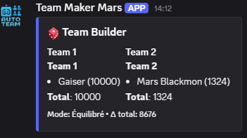

# 📗 Team Builder Bot — Guide Utilisateur (USER_GUIDE.md)

Le bot crée des **équipes équilibrées** (ou aléatoires) pour vos sessions de jeu.  
Il peut aussi **créer des salons vocaux** et y déplacer automatiquement les joueurs.

---

## 🚀 Démarrage rapide

1) Rejoignez un **salon vocal** avec vos amis.  
2) Tapez **/team** → le bot crée 2 équipes équilibrées.  


---

## 🧩 Définir votre niveau (3 façons)

### a) Sans Riot — définir votre **rang LoL** (offline)
```
/setrank user:@Moi tier:Gold division:II lp:60
```


### b) Rating **manuel**
```
/setskill user:@Moi rating:1250
```


### c) Lier votre **compte Riot** (si le bot a une clé Riot)
```
/linklol user:@Moi summoner:MonPseudoLoL region:EUW
```


> Si la clé Riot est absente/expirée, le lien est enregistré mais l’import est différé.  
> Tant que rien n’est défini, le bot vous considère **rating 1000**.

---

## 🎛️ Créer des équipes — options

### Équilibré vs Aléatoire
```
/team               # équilibré par défaut
/team mode:random   # totalement aléatoire
```

### Nombre d’équipes
```
/team team_count:3
```

### Tailles **fixes** (la somme doit = nb de joueurs)
```
/team team_count:3 sizes:"3/3/2"
```

### **Contraintes**
- Garder ensemble des joueurs :  
  ```
  /team with_groups:"@Alice @Bob | @Chloe @Dan"
  ```
- Séparer des paires :  
  ```
  /team avoid_pairs:"@Alice @Chloe ; @Evan @Fay"
  ```


### Utiliser des **mentions** au lieu du vocal
```
/team members:"@Alice @Bob @Chloe @Dan"
```

### Créer des **salons vocaux** + déplacer les joueurs
```
/team create_voice:true channel_ttl:45
```
→ crée *Team 1*, *Team 2*, … et supprime les salons **après 45 min**.  


Nettoyage manuel :
```
/disbandteams
```

---

## 📈 Comprendre l’embed de résultat

- Chaque équipe affiche : **joueurs + leur rating + total d’équipe**  
- Le pied de carte indique la **différence globale** (Δ) entre la team la plus haute et la plus basse  
- Message privé (éphémère) :  
  - **Import Riot** réussi pour certains joueurs  
  - Joueurs en **rating par défaut** (1000) → pensez à utiliser `/setrank` ou `/setskill`  


---

## 🔐 Commandes réservées (owner/admin)

- **/shutdown** : arrête le bot  
- **/restart** : redémarre le bot

> Si un **OWNER_ID** est défini, seul ce user peut lancer ces commandes.  
> Sinon, elles sont limitées aux **admins** (ou `Manage Server`).

---

## ❓FAQ

**Je ne vois pas /team**  
→ Le bot vient d’être relancé : attendez quelques secondes que les commandes se synchronisent.

**Je n’ai pas été déplacé dans mon salon**  
→ Il faut être **déjà connecté** à un vocal pour que Discord autorise le déplacement.

**Pourquoi je suis à 1000 ?**  
→ Vous n’avez pas encore défini de niveau. Utilisez `/setrank`, `/setskill` ou `/linklol`.

**Le bot n’a pas importé mon rang**  
→ Clé Riot expirée, pseudo/région erronés ou pas de ranked récente. Utilisez `/setrank` ou `/setskill`.

---

## 📷 Captures à fournir (placez-les dans `assets/`)

- `discord_team_embed.png` — Résultat basique de `/team`
- `discord_setrank_modal.png` — Formulaire `/setrank`
- `discord_setskill_modal.png` — Formulaire `/setskill`
- `discord_linklol_modal.png` — Formulaire `/linklol`
- `discord_constraints_example.png` — Exemple with_groups/avoid_pairs
- `discord_voice_channels_created.png` — Salons *Team 1*, *Team 2*
- `discord_team_embed_details.png` — Embed avec totaux et Δ
